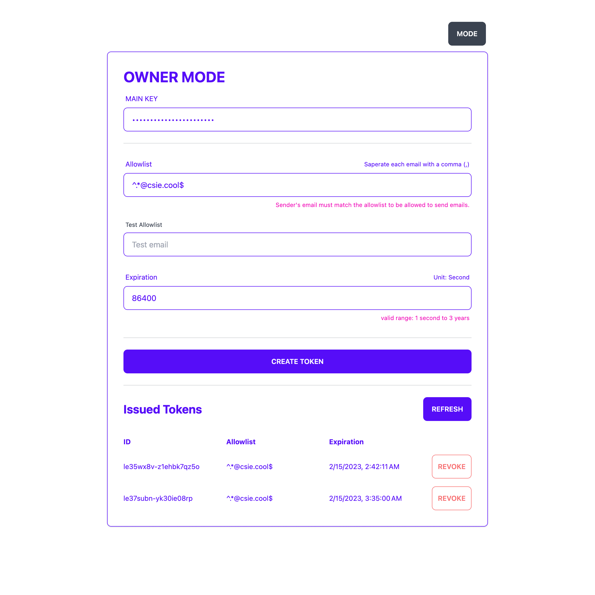
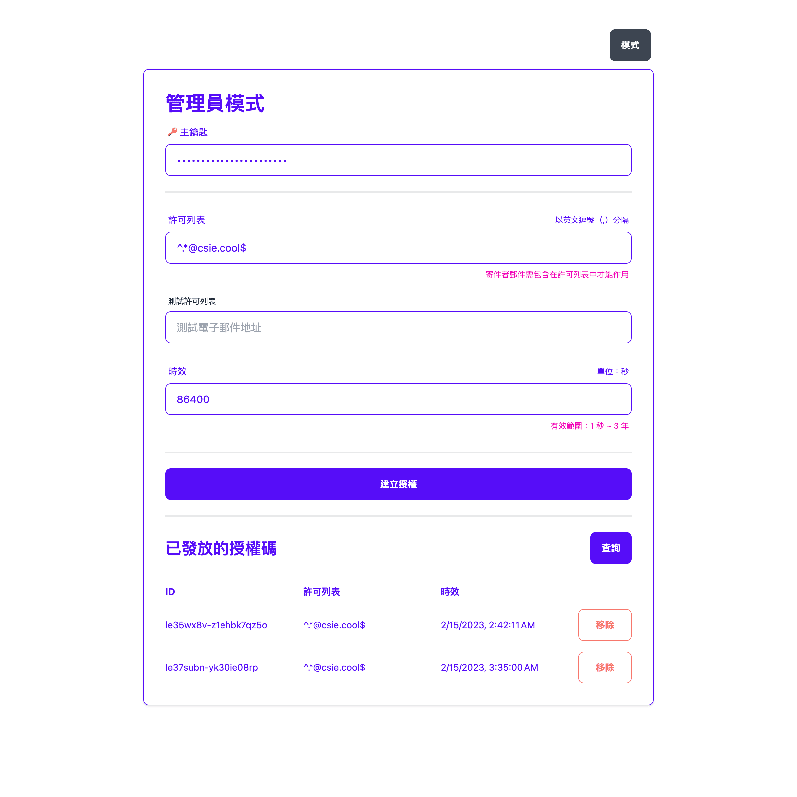

#  Hermes, mail service

Hermes is an open-source edge email sending service, which is designed to be easy to setup and use.

Example: [https://hermes.csie.cool/](https://hermes.csie.cool/)

| English | Chinese |
|:-------------------------:|:-------------------------:|
|||

## Features

- [x] Easy to Setup - You only need a browser to setup the service
- [x] Token-based authentication - Use allowlist and TTL to control the access
- [x] Web UI - Control the service from the anywhere
- [x] I18n - The web UI supports multiple languages (currently, English and Chinese)

## Getting Started

> First, you need to have a domain that is managed by Cloudflare.

1. Fork the repository
2. Setup the [Cloudflare Pages](https://pages.cloudflare.com/) for your forked repository
3. Binding a KV namespace to your Cloudflare Pages project as `STORE`
4. Set the `app:config` key in the KV namespace to the following JSON:

```json
{
  "MAIN_KEY": "YOUR_MAIN_KEY"
}
```

> You can also set other configurations in the `app:config` key, see [config.ts](./src/lib/server/config.ts) for more details.
> For example, you can set `CORS` to `"*"` to allow CORS requests from anywhere.

All of the above can be done in the browser! No need to install anything.

## API Usage

Once you have generated a token, you can use the API to send emails.

See [examples](./examples/) for more details.

## Credits

The icon is based on Boxicons [https://boxicons.com/](https://boxicons.com/).
